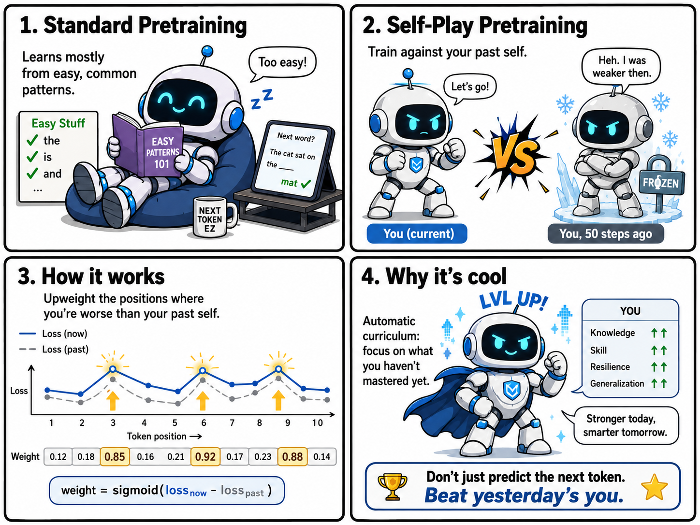
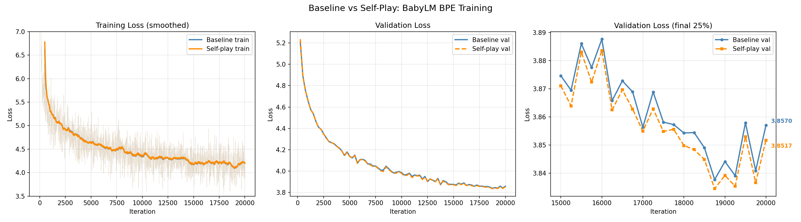

# nanoGPT + Self-Play



A GPT trained with a self-play pretraining mode inspired by AlphaGo.
Built on [nanoGPT](https://github.com/karpathy/nanoGPT) by Andrej Karpathy.

## What is self-play pretraining?

Standard pretraining minimises cross-entropy loss averaged uniformly across all token positions.
This means early training is dominated by easy, high-frequency patterns.

The self-play mode maintains a frozen **opponent** — a snapshot of the model from 50 iterations ago.
At each step, positions where the current model underperforms its past self are upweighted:

```
weight(position) = sigmoid(loss_current - loss_opponent)
loss = (1 - λ) * standard_loss + λ * weighted_loss
```

This creates an automatic curriculum: training focuses on what the model hasn't yet mastered,
while the opponent advances every 50 iterations so the difficulty keeps scaling up.
The analogy to AlphaGo is direct — you always train against a version of yourself.

## Results

### Loss curves (BabyLM BPE, 20,000 iterations)



| Model | Val Loss | Perplexity | Overall Acc | Common Acc | Rare Acc |
|---|---|---|---|---|---|
| Baseline | 3.8666 | 47.78 | 31.79% | 35.75% | 4.06% |
| Self-play | 3.8615 | 47.54 | 31.88% | 35.81% | 4.31% |
| Δ (SP − BL) | **−0.005 ✓** | **−0.24 ✓** | **+0.09%** | **+0.07%** | **+0.25%** |

Self-play wins on all metrics. Crucially, rare token accuracy improves 3.5× more than common token
accuracy (+0.25% vs +0.07%) — directly consistent with the curriculum hypothesis that self-play
focuses training on positions the model hasn't yet mastered.

The self-play training loss is noisier early on (expected — harder-position weighting makes early
gradients more variable), but both models converge to similar val loss curves before self-play
pulls ahead in the final iterations.

## Install

```sh
pip install -r requirements.txt
```

Requires PyTorch 2.0+. Apple Silicon (MPS) and CUDA are supported.

## Quick start

### 1. Prepare a dataset

```sh
# Tiny Shakespeare (~1M chars, character-level, good for quick experiments)
python data/shakespeare_char/prepare.py

# BabyLM 10M (BPE, child-directed English, recommended)
python data/babylm/prepare.py

# OpenWebText (~9B tokens, BPE, requires significant disk space and time)
python data/openwebtext/prepare.py
```

### 2. Run the full experiment

The easiest way to train both models and compare them is:

```sh
python run_experiment.py
```

This submits both training jobs via the GPU task spooler, waits for them to finish,
plots loss curves to `loss_curves.png`, runs `eval.py`, and prints a winner verdict.

```sh
python run_experiment.py --resume     # continue from existing checkpoints
python run_experiment.py --eval_only  # skip training, just plot and evaluate
```

### 3. Train manually

Each dataset has a paired baseline and self-play config.

**BabyLM (BPE, recommended):**
```sh
python train.py config/train_babylm.py
python train_selfplay.py config/train_selfplay_babylm.py
```

**Tiny Shakespeare (character-level, fast iteration):**
```sh
python train.py config/train_shakespeare_char.py --device=mps --compile=False
python train_selfplay.py config/train_selfplay_shakespeare_char.py --device=mps --compile=False
```

### 4. Sample

```sh
python sample.py --out_dir=out-babylm --start="Once upon a time"
python sample.py --out_dir=out-babylm-selfplay --start="Once upon a time"
```

### 5. Evaluate

```sh
python eval.py \
    --baseline_dir=out-babylm \
    --selfplay_dir=out-babylm-selfplay \
    --device=cuda
```

This reports:

- **Val loss and perplexity** side by side
- **Top-1 token accuracy** overall
- **Common vs rare token accuracy** — the key test of the self-play hypothesis.
  Common tokens are those covering 80% of training data by frequency.
  Self-play should specifically improve accuracy on rare tokens.
- **Side-by-side generation** from the same seed and prompt

The self-play model typically descends more slowly in early iterations — this is expected,
as it spends gradient budget on harder positions rather than easy wins.

### Eval flags

| Flag | Default | Description |
|---|---|---|
| `--baseline_dir` | `out-babylm` | Baseline checkpoint directory |
| `--selfplay_dir` | `out-babylm-selfplay` | Self-play checkpoint directory |
| `--device` | `cpu` | Device for inference (`cuda` recommended) |
| `--eval_iters` | `200` | Validation batches to average over |
| `--prompt` | `\n` | Seed text for generation comparison |
| `--max_new_tokens` | `400` | Tokens to generate |
| `--temperature` | `0.8` | Sampling temperature |
| `--seed` | `1337` | RNG seed (same for both models) |
| `--common_threshold` | `0.8` | Cumulative frequency defining "common" tokens |

## Config reference

All hyperparameters can be overridden from the command line with `--key=value`.

| Parameter | BabyLM default | Description |
|---|---|---|
| `device` | `cuda` | `cuda`, `mps`, or `cpu` |
| `compile` | `True` | `torch.compile` — set `False` on MPS |
| `max_iters` | `20000` | Training iterations |
| `batch_size` | `16` | Sequences per batch |
| `block_size` | `128` | Context length in tokens |
| `n_layer` | `6` | Transformer layers |
| `n_head` | `6` | Attention heads |
| `n_embd` | `384` | Embedding dimension (~30M parameters) |
| `learning_rate` | `3e-4` | Peak learning rate |
| `dropout` | `0.1` | Dropout rate |
| `eval_interval` | `250` | Iterations between val loss checks |
| `always_save_checkpoint` | `True` | Save checkpoint at every eval |

**Self-play only:**

| Parameter | Default | Description |
|---|---|---|
| `opponent_update_interval` | `50` | How often to sync opponent to current weights |
| `selfplay_lambda` | `0.5` | Blend of standard vs weighted loss |

## File structure

```
train.py                              # baseline training loop
train_selfplay.py                     # self-play training loop
eval.py                               # compare baseline vs self-play
run_experiment.py                     # end-to-end: train → plot → eval
sample.py                             # generate text from a checkpoint
model.py                              # GPT architecture
configurator.py                       # CLI argument parsing
requirements.txt

config/
  train_babylm.py                     # baseline on BabyLM (BPE)
  train_selfplay_babylm.py            # self-play on BabyLM (BPE)
  train_shakespeare_char.py           # baseline on Tiny Shakespeare (char)
  train_selfplay_shakespeare_char.py  # self-play on Tiny Shakespeare (char)

data/
  babylm/prepare.py                   # downloads BabyLM 10M from HuggingFace
  shakespeare_char/prepare.py         # downloads Tiny Shakespeare
  openwebtext/prepare.py              # downloads OpenWebText
```

## Datasets

| Dataset | Tokenisation | Size | Notes |
|---|---|---|---|
| `shakespeare_char` | character | ~1M chars | Fast iteration, overfits quickly |
| `babylm` | BPE (GPT-2) | ~10M tokens | Child-directed English, recommended |
| `openwebtext` | BPE (GPT-2) | ~9B tokens | Web-scale, requires a GPU cluster |

## Hardware notes

Tested on Apple M2 MacBook Air (MPS) and a multi-GPU cluster (CUDA).
Pass `--compile=False --device=mps` on Apple Silicon — `torch.compile` is unreliable on MPS.

On the GPU cluster, 20,000 iterations of BabyLM training takes ~20 minutes per model.
The self-play loop runs two forward passes per step (~1.5× slower than baseline).
